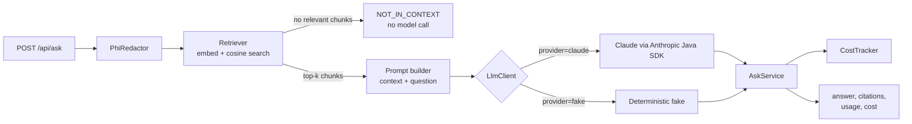

# claims-rag-java

A sample **Spring Boot** service that answers questions about (invented) health-insurance claim policies using
**retrieval-augmented generation (RAG)** with **Claude**, plus an **evaluation suite** and **token/cost tracking**.

> **Honest scope:** this is a learning and portfolio project. It runs on synthetic data, has no real users, and makes no
> production-scale claims. It shows how I would structure an LLM-backed service, measure its quality and track what it costs.
> A sibling repo, [`claims-rag-python`](https://github.com/miguelmora76/claims-rag-python), implements the same service in Python and FastAPI.

## Contents

- [What it does](#what-it-does)
- [How it works](#how-it-works)
- [What this project demonstrates](#what-this-project-demonstrates)
- [Quick start (no API key needed)](#quick-start-no-api-key-needed)
- [Get an Anthropic API key](#get-an-anthropic-api-key)
- [Run with real Claude](#run-with-real-claude)
- [API reference](#api-reference)
- [Evals](#evals)
- [Configuration](#configuration)
- [Project layout](#project-layout)
- [Known limits](#known-limits)

## What it does

You send a question like *"How many days do I have to file a first-level appeal?"* to an HTTP endpoint. The service:

1. Redacts obvious personal identifiers (SSNs, phone numbers, emails) from the question.
2. Retrieves the most relevant passages from a small knowledge base of policy documents.
3. Sends only those passages and the question to Claude, instructing it to answer **only** from the passages and to cite them.
4. Returns the answer, the citations, the passages it used, the token usage and the cost in USD.
5. If nothing relevant is found, or the passages don't contain the answer, it says so instead of guessing.

The knowledge base is seven short documents in `src/main/resources/corpus/` (timely filing, denial codes, appeals, prior
authorization, coordination of benefits, payments, eligibility). **They are invented for this project and are not real payer rules.**

## How it works



The model sits behind a small `LlmClient` interface. That is what lets the tests and CI run offline against a
deterministic fake, while the real thing calls Claude.

## What this project demonstrates

| Area | Where to look |
|---|---|
| Calling an LLM API from Java with the official SDK, typed error handling, usage metadata | `llm/ClaudeLlmClient.java` |
| Provider interface with an offline fake for tests and CI | `llm/LlmClient.java`, `llm/FakeLlmClient.java` |
| RAG: chunking, embeddings, vector search, grounded prompt with citations | `rag/`, `service/AskService.java` |
| Prompt-injection posture: untrusted context, answer-only-from-context, explicit abstain token | `AskService.SYSTEM` |
| Token and cost tracking per request and per model | `cost/CostTracker.java`, `GET /api/usage` |
| Eval suite: golden set, retrieval/context/citation/abstention metrics, optional LLM judge | `eval/`, `src/main/resources/eval/golden.json` |
| Eval as a CI gate | `EvalSuiteTest`, `.github/workflows/ci.yml` |
| Pattern-based redaction before text leaves the service | `privacy/PhiRedactor.java` |

## Quick start (no API key needed)

By default the app uses a **fake model**, so you can build, test and call it with no key and no cost.

**Prerequisites:** Java 21 or newer, and Maven 3.9 or newer. (Developed on Java 23.)

```bash
git clone https://github.com/miguelmora76/claims-rag-java.git
cd claims-rag-java

mvn verify                 # compile, run unit tests and the offline eval gate
mvn spring-boot:run        # start the server on http://localhost:8080
```

In a second terminal:

```bash
curl -s localhost:8080/api/ask -H 'content-type: application/json' \
  -d '{"question":"How many days do I have to file a first-level appeal?"}'

curl -s localhost:8080/api/usage
```

With the fake model the answer is just the best-matching sentence from the retrieved text. That is enough to exercise
the retrieval, citation and cost-tracking code. For real answers, use Claude as described below.

## Get an Anthropic API key

To use real Claude you need an Anthropic API key. Keys are managed in the Anthropic Console.

1. Go to **https://console.anthropic.com** and sign in, or create an account.
2. Set up billing: open **Billing** (or **Plans & Billing**) and add a payment method or buy a small amount of credit.
   API usage is billed separately from any Claude chat subscription; check the Console for current billing options and any credits on your account. One full eval run of this project costs about **5 US cents**.
3. Open **Settings → API keys** (direct link: https://console.anthropic.com/settings/keys) and click **Create key**.
   Name it (for example `claims-rag-local`) and, if asked, choose a workspace.
4. **Copy the key immediately.** It starts with `sk-ant-` and is shown only once. If you lose it, create a new one.
5. Keep it secret: never commit it, paste it into a chat, or put it in a file tracked by git. If it leaks, delete it in the Console and create another.

> **User-scoped keys:** if your key starts with `sk-ant-usr-` instead of being created inside a workspace, the API will
> also require a workspace ID. Set `ANTHROPIC_WORKSPACE_ID` (it looks like `wrkspc_...` and is on the workspace's settings
> page in the Console). Keys created inside a workspace do not need this.

Pricing and available models change over time. Check the Console and Anthropic's pricing page before relying on the cost figures here.

## Run with real Claude

Put the key in an environment variable for your current terminal only. This prompt hides what you type and keeps the key out of your shell history:

```bash
read -s ANTHROPIC_API_KEY && export ANTHROPIC_API_KEY
# only for sk-ant-usr-... keys:
# export ANTHROPIC_WORKSPACE_ID=wrkspc_...

mvn spring-boot:run -Dspring-boot.run.arguments="--assistant.provider=claude"
```

Then call the same endpoints as above. The response now contains real token counts and a non-zero `costUsd`, and
`GET /api/usage` shows the running totals per model.

The default model is `claude-opus-5-5` at `effort: low`. Change it in `src/main/resources/application.yml`.

## API reference

### `POST /api/ask`

Request body:

```json
{ "question": "How many days do I have to file a first-level appeal?" }
```

`question` is required, must not be blank, and is limited to 2000 characters (otherwise `400`).

Example response (from the offline fake model; the retrieved text is shortened here):

```json
{
  "answer": "A first-level appeal must be filed within 120 days of the date on the remittance advice that shows the denial. [appeals#0]",
  "answered": true,
  "citations": ["appeals#0"],
  "retrieved": [
    { "chunkId": "appeals#2", "title": "Claim Appeals Process", "score": 0.27, "text": "Northwind Health decides first-level appeals within 30 calen..." },
    { "chunkId": "appeals#0", "title": "Claim Appeals Process", "score": 0.17, "text": "Synthetic policy text for demonstration only. Not real payer..." },
    { "chunkId": "appeals#1", "title": "Claim Appeals Process", "score": 0.17, "text": "A first-level appeal must include the denial letter or remit..." }
  ],
  "usage": { "inputTokens": 299, "outputTokens": 30, "cacheReadTokens": 0, "cacheWriteTokens": 0 },
  "costUsd": 0.0,
  "latencyMs": 0
}
```

| Field | Meaning |
|---|---|
| `answered` | `false` when the system declined (nothing relevant retrieved, or the model replied `NOT_IN_CONTEXT`) |
| `citations` | chunk ids the answer cites, in `document#chunk` form |
| `retrieved` | the passages sent to the model, with similarity score |
| `costUsd` | computed from token usage and the price table in `application.yml` (0 for the fake model) |

If the Claude call fails, the endpoint returns `503` for retryable errors (rate limit, 5xx, connection) and `502` otherwise.

### `GET /api/usage`

Running token and cost totals per model since the process started.

## Evals

An **eval** measures whether the system's output is good, in a repeatable way. This project has a golden set of 15
questions in `src/main/resources/eval/golden.json`: 12 with known answers and 3 that should be refused (two out of
scope and one prompt-injection attempt). For each question it checks:

| Metric | What it checks |
|---|---|
| Retrieval recall | a chunk from the expected document was retrieved |
| Context recall | the retrieved text actually contains the facts needed to answer |
| Fact coverage | the answer contains the required facts |
| Citation validity | the answer cites only chunks that were retrieved |
| Citation correctness | the answer cites the expected document |
| Abstain accuracy | unanswerable questions are declined |
| Judge groundedness (live only) | a second Claude model scores 1-5 how well the answer is supported by the retrieved text |

```bash
# offline pipeline eval (this is what CI gates on)
mvn spring-boot:run -Dspring-boot.run.arguments="--assistant.eval=true --spring.main.web-application-type=none"

# live eval against Claude, with the judge (needs an API key, costs about $0.05)
mvn spring-boot:run -Dspring-boot.run.arguments="--assistant.eval=true --assistant.provider=claude --spring.main.web-application-type=none"
```

The report prints to the console and is written to `eval-report/report.md`. The process exits with code `1` if the pass
rate is below 90% and `2` if the model call fails.

### Results (live, 2026-10-05, `claude-opus-5-5` at low effort, judge `claude-haiku-4-5`)

| Metric | Run 1 (before retrieval fixes) | Run 2 (after) |
|---|---|---|
| Retrieval recall | 100% | 100% |
| Context recall | not measured | 100% |
| Fact coverage | 85% | 100% |
| Citation correctness | 85% | 100% |
| Abstain accuracy | 100% | 100% |
| Case pass rate | 88% | 100% |
| Cost per run | about $0.05 | about $0.05 |

The judge scores from these runs are **not reported**: the judge was handed only chunk ids and titles instead of the
chunk text, so its numbers did not measure groundedness. That bug is fixed in the code and the judge has not been re-run since.

What changed between the runs: run 1 failed two questions that answered `NOT_IN_CONTEXT` even though the right document was
retrieved. That showed the "expected document in top-k" metric was too lenient, so I added **context recall** and fixed
what it pointed at (suffix stemming, so "decided" matches "decides", and an exact-match boost for denial codes such as `CO-27`).

**How much to trust these numbers:** they come from single runs, the golden set is small and written by the same person
who wrote the corpus, and I tuned retrieval against that set. Treat 100% as "the pipeline works end to end", not as a
measure of how it would perform on unseen questions.

### What the offline eval does and does not tell you

Offline, the "model" is a fake that extracts the best-matching sentence. It checks the plumbing: retrieval, prompt
assembly, citation parsing, abstention and cost accounting. The CI gate asserts only those. Fact coverage and pass rate are
reported offline but not gated, because the fake often picks the wrong sentence from correct context.

## Configuration

Set in `src/main/resources/application.yml`, or override on the command line, for example `--assistant.top-k=5`.

| Property | Default | Meaning |
|---|---|---|
| `assistant.provider` | `fake` | `fake` (offline) or `claude` |
| `assistant.model` | `claude-opus-5-5` | model used to answer |
| `assistant.judge-model` | `claude-haiku-4-5` | model used by the eval judge |
| `assistant.max-tokens` | `1024` | output cap per answer |
| `assistant.effort` | `low` | reasoning effort; blank to omit (some models reject it) |
| `assistant.top-k` | `3` | passages retrieved per question |
| `assistant.min-score` | `0.08` | minimum similarity for a passage to count |
| `assistant.pricing.*` | see file | USD per million tokens per model. Copied from published rates; verify before relying on it |

Environment variables: `ANTHROPIC_API_KEY` (required for `provider=claude`) and `ANTHROPIC_WORKSPACE_ID` (only for `sk-ant-usr-` keys).

## Project layout

```
src/main/java/dev/claimsrag/
  ClaimsRagApplication.java      Spring Boot entry point
  config/AssistantProperties     typed settings from application.yml
  llm/                           LlmClient interface, Claude implementation, offline fake, usage types
  rag/                           chunker, hashing embedder, vector store, retriever, wiring
  service/AskService             redact -> retrieve -> prompt -> model -> cite -> cost
  cost/CostTracker               token usage to USD, per-model totals
  privacy/PhiRedactor            regex redaction of common identifiers
  web/AskController              REST endpoints
  eval/                          golden-set runner, metrics, LLM judge, CLI command
src/main/resources/
  corpus/*.md                    the invented policy documents
  eval/golden.json               the golden question set
  application.yml
src/test/java/dev/claimsrag/     unit tests, API tests, offline eval gate
.github/workflows/ci.yml         runs `mvn verify` on every push and pull request
```

## Known limits

- **Embeddings are lexical, not semantic.** The embedder hashes words and word pairs with IDF weighting, crude stemming and a boost for code-like tokens. It cannot match synonyms. The `Embedder` interface is where a real embedding model would plug in.
- **The vector store is brute force and in memory.** Fine for hundreds of chunks, not for large corpora.
- **The golden set is small** and written by the same person who wrote the corpus, so scores are optimistic.
- **Redaction is regex-based.** `PhiRedactor` misses names, addresses and free text. It shows where redaction belongs; it is not HIPAA de-identification, and this project makes no compliance claims.
- **Not production-ready:** no authentication, rate limiting, streaming, persistence, retries beyond the SDK's own, or prompt caching (the system prompt is below the minimum cacheable size). Server-side refusal fallbacks are not configured.
- No license file is included yet, so default copyright applies.
